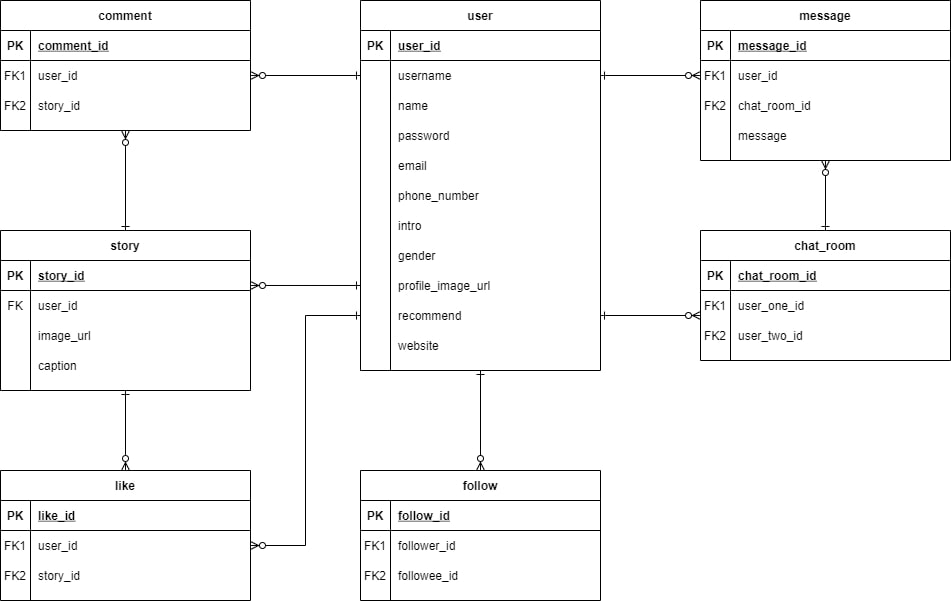

# 목적
--- ---
- SNS를 직접 구현해 보면서 Backend System의 도메인을 이해하자.
- 단순 기능 구현이 아닌 어떻게 하면 성능을 개선할 수 있을 지 고민해보자.

# 프로젝트 주요 기능
--- ---
- 로그인
    - username, 핸드폰 번호, 이메일 중 하나를 선택해 Login할 수 있다.
    - Facebook, Google 로그인을 할 수 있다.
    
- 회원 가입
    - username, name, 이메일 혹은 핸드폰번호, 비밀번호를 입력하고 회원 가입을 할 수 있다.
        - username : ID로 사용된다.
        - name : 사용자의 이름
    
- 회원 정보 수정 및 비밀번호 변경
    - 사용자의 프로필 사진, 소개 글, website, 성별, username, name등을 변경할 수 있다.
    - 이메일과 핸드폰 번호는 변경할 수 없다.
    
- 팔로우 / 언팔로우
    - 특정 User를 Follow할 수 있고 취소 할 수 있다.
    
- 게시물 업로드
    - 사진과 사진에 대한 설명을 포함한 게시물을 업로드 할 수 있다.
    - 사진은 게시물 작성 시 반드시 포함되어야 한다.
    
- 게시물 좋아요 / 좋아요 취소
    - 업로드 된 게시물에 좋아요를 하거나 취소할 수 있다.
    
- 게시물 댓글
    - 업로드 된 게시물에 댓글을 남길 수 있다.
    
- 사용자 검색 기능
    - username을 통해 사용자를 검색할 수 있다.
    
- DM기능
    - 검색을 통해 선택한 사용자와 1:1 실시간 채팅을 할 수 있다.
    
- 알람 기능
    - 자신의 게시물에 좋아요 혹은 댓글이 추가 되었을 때 알람을 받는다.
    - 새로운 DM에 대해 알람을 받는다.

# DB
--- ---

[user](https://www.notion.so/b3847087f3cd4e159023c1bd6040f1ef)

[story](https://www.notion.so/ae5a8b8abdc04cd9a27308fb8aa722ae)

[comment](https://www.notion.so/7c5e29ca4d914ebd95d63ce4950acd10)

[like](https://www.notion.so/38fca44a581141528d4bbe512a43df09)

[follow](https://www.notion.so/e436de1d4ae94a7791abccff9d03a6ad)

[chat_room](https://www.notion.so/3c0c019381a6476f864f3b8fb590e07c)

[message](https://www.notion.so/a0aa00df01834d11bad29287e1a32dbc)